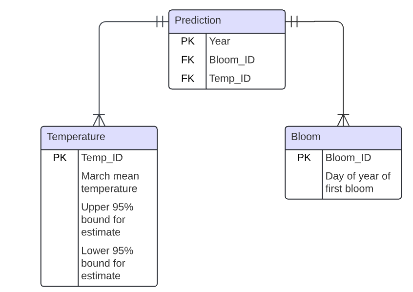

# Normalised database with un-normalised data

## Data set sample

| year | doy | date  | temp | temp_upper | temp_lower |
|:-----|:----|:------|:-----|:-----------|:-----------|
| 864  | 100 | 10/04 | 6.42 | 8.69       | 4.14       |
| 866  | 106 | 16/04 | 6.44 | 8.11       | 4.77       |

The date field is not being used in the REST API.

The above table will be split into 3 tables as per the ERD:

The REST API will return data that relates to one of the above rows from the original dataset. However, the data will
in the database will not be in a single table, it will be in multiple related tables. This requires more coding.

**NB**: For the REST API, the database could have been created as a single un-normalised table with a model class that
had the fields as per the .csv file (excluding date).

The student decided to normalise the database, and (I think) also wants to store multiple future predictions in their
next app for coursework 2, so they want to have the more complex structure.

If you do not need the normalised database for coursework 1 (i.e. if the original dataset structure will work for your
REST API), and you are creating a Dashboard app in coursework 2, then you can skip creating the more complex database
structure as you probably will not need it.

## Create the models

See [complexdb/models.py](/complexdb/models.py)

## Create the schemas

See [complexdb/schemas.py](/complexdb/schemas.py)

These have some added complexity as the Schemas are nested to represent the relations between objects. See
the [documentation](https://marshmallow.readthedocs.io/en/stable/nesting.html#nesting-schemas).

## Create the database in \__init\__.py

See [/complexdb/\__init\__.py](/complexdb/__init__.py)

## Create a function to add the data

See [/complexdb/db_utils.py](/complexdb/db_utils.py)

**This is the complex part. Please read the comments in the code file.**

## Add routes to routes.py

See [/complexdb/routes.py](/complexdb/routes.py)

GET route added to routes.py to show the usage.
Run the app and go to /predictions

The PATCH route may be more complex as you have to work out the logic to handle updating fields in 3 tables (DELETE
should be easier).